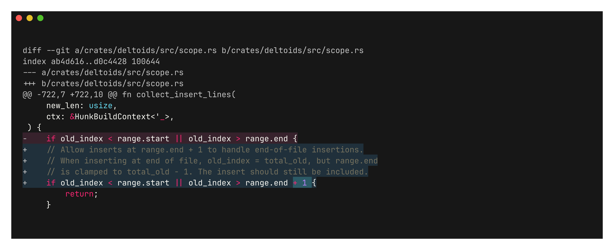
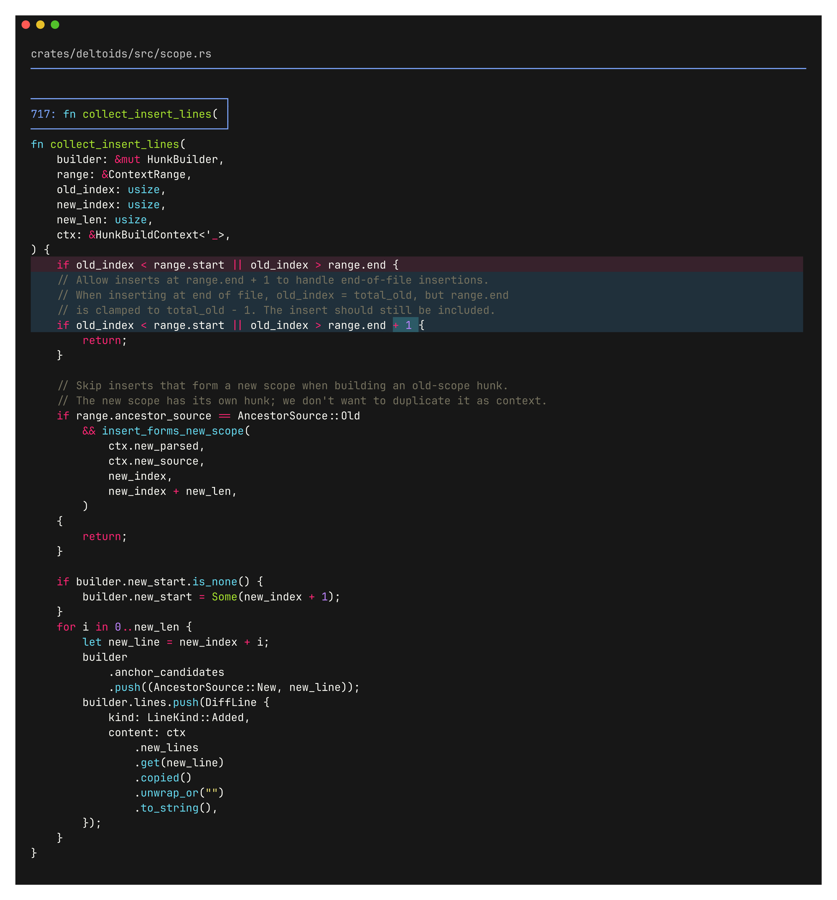

# deltoids

> [!WARNING]
> This project is under active development. Diff output may still be broken. In case of doubt, verify changes with another pager.

Tools for reviewing code in the agentic era.

<table>
  <tr>
    <td valign="top"></td>
    <td valign="top"></td>
  </tr>
  <tr>
    <td align="center"><em>git diff</em></td>
    <td align="center"><em>deltoids</em></td>
  </tr>
</table>

Hunks expand to show the enclosing function, so you always know where you are.

## Overview

Deltoids diffs have language-aware syntax highlighting and word-level highlighting within changed lines. They also expand to include relevant context, usually the enclosing function or struct up to 200 lines. This allows you to quickly view the entire context without having to switch to an editor.

Tools:

- `deltoids pager`: ANSI diff filter for `less` / `core.pager`
- `deltoids review`: review tool
- `deltoids edit`: file edit tool (used by coding agents)
- `deltoids write`: file write tool (used by coding agents)
- `deltoids traces`: trace browser to follow agents in real-time

`edit` and `write` are CLI versions of AI coding agent tools. By providing these custom CLIs, we can tell coding agents to generate summaries for each change and visualize them with `deltoids traces` separately from the coding agent UI.

## Installation

**Homebrew:**

```bash
brew install juanibiapina/taps/deltoids
```

**Prebuilt binaries (shell installer):**

```bash
curl --proto '=https' --tlsv1.2 -LsSf https://github.com/juanibiapina/deltoids/releases/latest/download/deltoids-cli-installer.sh | sh
```

**From source (cargo):**

```bash
cargo install --git https://github.com/juanibiapina/deltoids deltoids-cli
```

## Usage

### Standalone

Pipe any unified diff through `deltoids`:

```bash
git diff | deltoids | less -R
git show HEAD~1 | deltoids | less -R
git log -p | deltoids | less -R
```

### Git Integration

Set `deltoids` as your default pager:

```bash
git config --global core.pager 'deltoids | less -R'
```

Or for a specific command:

```bash
git config --global pager.diff 'deltoids | less -R'
git config --global pager.show 'deltoids | less -R'
git config --global pager.log 'deltoids | less -R'
```

### Lazygit Integration

Add to `~/.config/lazygit/config.yml`:

```yaml
git:
  paging:
    pager: deltoids
```

## Coding Agent Integrations

### pi

Install the deltoids plugin for pi to override built-in `edit` and `write` tools with the traced versions:

```bash
pi install https://github.com/juanibiapina/deltoids
```

Requires the `deltoids` binary on PATH. See [plugins/pi/README.md](plugins/pi/README.md) for details.

Then run `deltoids traces` in the same directory as pi to see real-time diffs with summaries.

### Claude Code

Install the deltoids plugin to record every `Write` and `Edit` call as a trace, grouped by Claude session:

```bash
claude plugin marketplace add juanibiapina/deltoids
claude plugin install deltoids@deltoids
```

Or, from inside an interactive session, run `/plugin marketplace add juanibiapina/deltoids` then `/plugin install deltoids@deltoids`.

The Claude `session_id` is used directly as the deltoids trace id, so continuing a session (`claude --continue`) keeps appending to the same trace. Requires the `deltoids` binary on PATH. See [plugins/claude-code/README.md](plugins/claude-code/README.md) for details, including a `~/.claude/settings.json` snippet that bypasses the known [plugin hook delivery bug](https://github.com/anthropics/claude-code/issues/34573).

Unlike the pi integration, Claude Code edits are recorded without a per-edit summary. Claude's `PostToolUse` hook does not expose one.
