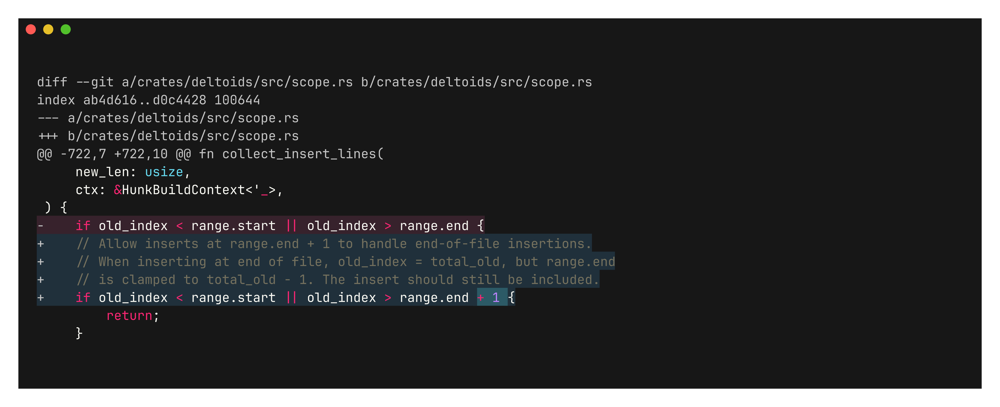
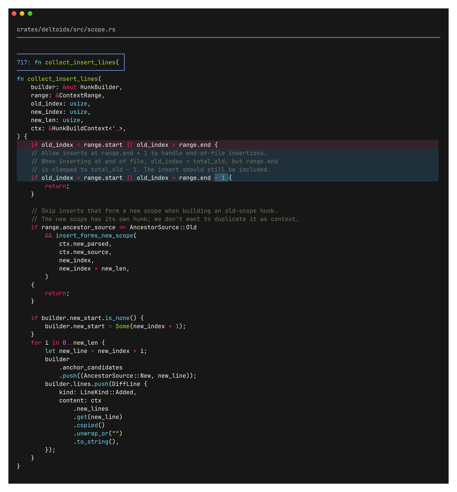

# deltoids

> [!WARNING]
> This project is under active development. Diff output may still be broken. In case of doubt, verify changes with another pager.

Tools for reviewing code in the agentic era.

<table>
  <tr>
    <td valign="top"></td>
    <td valign="top"></td>
  </tr>
  <tr>
    <td align="center"><em>git diff</em></td>
    <td align="center"><em>deltoids</em></td>
  </tr>
</table>

Hunks expand to show the enclosing function, so you always know where you are.

## Features

- **Syntax highlighting:** spot code changes at a glance.
- **Expanded context:** understand changes within their enclosing scope.
- **Agent traces:** follow agent changes in real time.
- **Git integration:** review file status and manage changes in one place.
- **Review comments:** turn review feedback into prompts for coding agents.
- **Responsive TUI:** keep up with changes without unnecessary redraws.
- **Syntax themes:** choose colors that suit your workflow.
- **Custom commands:** use your own tools while reviewing.

## Get Started

Install deltoids and the Pi plugin:

```bash
brew install juanibiapina/taps/deltoids
pi install https://github.com/juanibiapina/deltoids
```

The plugin records Pi's edits and writes as traces. In the same project directory, open the reviewer:

```bash
deltoids tui
```

## Alternative Installation

**Prebuilt binaries (shell installer):**

```bash
curl --proto '=https' --tlsv1.2 -LsSf https://github.com/juanibiapina/deltoids/releases/latest/download/deltoids-cli-installer.sh | sh
```

**From source (cargo):**

```bash
cargo install --git https://github.com/juanibiapina/deltoids deltoids-cli
```

## Usage

### Lazygit Integration

Add to `~/.config/lazygit/config.yml`:

```yaml
git:
  paging:
    pager: deltoids
```

### Git Integration

Set `deltoids` as your default pager:

```bash
git config --global core.pager 'deltoids | less -R'
```

Or for a specific command:

```bash
git config --global pager.diff 'deltoids | less -R'
git config --global pager.show 'deltoids | less -R'
git config --global pager.log 'deltoids | less -R'
```

### Standalone

Pipe any unified diff through `deltoids`:

```bash
git diff | deltoids | less -R
git show HEAD~1 | deltoids | less -R
git log -p | deltoids | less -R
```

## Configuration

Deltoids reads `$XDG_CONFIG_HOME/deltoids/config.toml` (falling back to
`~/.config/deltoids/config.toml`).

### Theme

The `[theme]` section selects the light/dark palette and the syntax
highlighting theme used by the pager, the `deltoids tui`, and `deltoids
serve`:

```toml
[theme]
# "light" | "dark" | "auto" (default: auto — detect from the terminal).
mode = "auto"
# Syntax highlighting theme by name. Bundled themes include "TokyoNight"
# plus every theme bat ships (e.g. "Monokai Extended", "GitHub", "Nord",
# "Dracula"). When unset, deltoids uses `BAT_THEME`, then a per-mode
# default (Monokai Extended on dark, GitHub on light).
syntax_theme = "TokyoNight"
```

In `deltoids tui`, press `t` to open a picker and switch the syntax theme
live; the diff recolors immediately without re-parsing. The picker starts
from the theme resolved above, so `syntax_theme` sets your durable
default and `t` overrides it for the session.

Individual chrome colors (diff backgrounds, borders, status letters) can
also be overridden per-field with hex values in the same `[theme]`
section.

### Custom commands

Bind a key in `deltoids tui` to a shell command that runs against the
selected file. `{{filename}}` expands to the selected file's absolute
path (shell-quoted, so paths with spaces work):

```toml
# Background (default): dispatches elsewhere and returns immediately.
# The TUI never touches the terminal, so there is no flicker.
[[commands]]
key = "e"
command = "dev tmux edit {{filename}}"
description = "edit file in a tmux pane"

# Subprocess: takes over the terminal for an inline editor. The TUI
# suspends, hands the terminal to the child, then restores and repaints.
[[commands]]
key = "E"
command = "nvim {{filename}}"
subprocess = true
description = "edit file inline in neovim"
```

`subprocess` defaults to `false`. `command` is a shell line (run via
`sh -c`), not an argv. Custom keys work in both Files and Traces mode
against the current selection; they cannot override the built-in keys
(`q`, `[`, `]`, `<`, `>`, `\`, `t`, `?`) but can shadow a mode's own keys. Press
`?` to see the configured bindings in the help popup.

## Claude Code Integration

Install the deltoids plugin to record every `Write` and `Edit` call as a trace, grouped by Claude session:

```bash
claude plugin marketplace add juanibiapina/deltoids
claude plugin install deltoids@deltoids
```

Or, from inside an interactive session, run `/plugin marketplace add juanibiapina/deltoids` then `/plugin install deltoids@deltoids`.

The Claude `session_id` is used directly as the deltoids trace id, so continuing a session (`claude --continue`) keeps appending to the same trace. Requires the `deltoids` binary on PATH. See [plugins/claude-code/README.md](plugins/claude-code/README.md) for details, including a `~/.claude/settings.json` snippet that bypasses the known [plugin hook delivery bug](https://github.com/anthropics/claude-code/issues/34573).

Unlike the pi integration, Claude Code edits are recorded without a per-edit summary. Claude's `PostToolUse` hook does not expose one.
